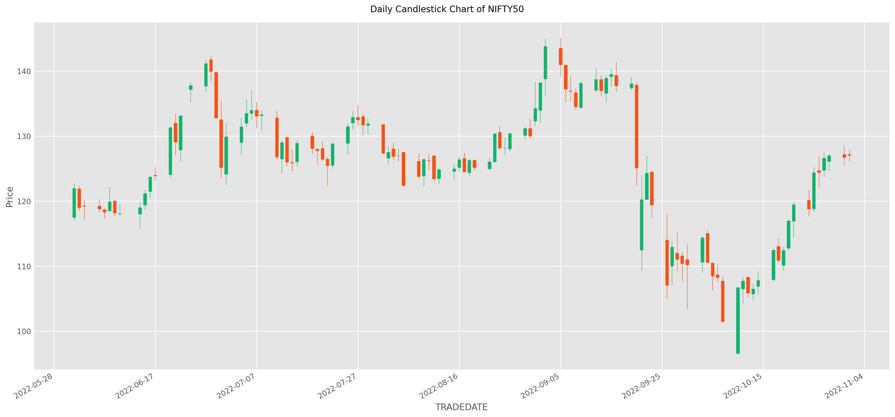
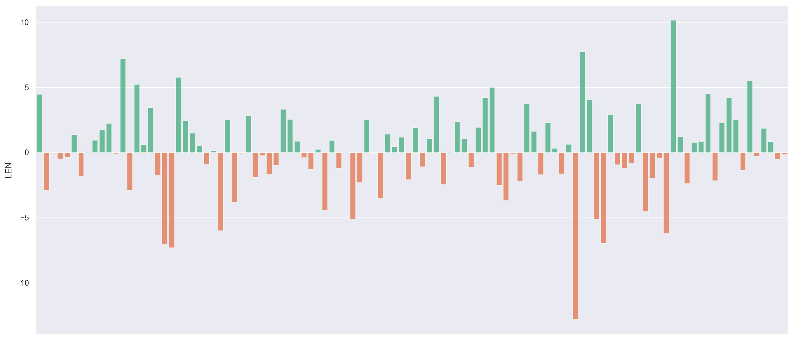
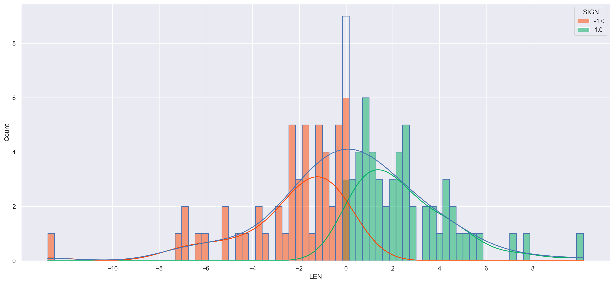
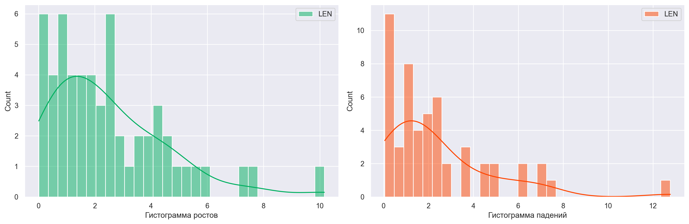
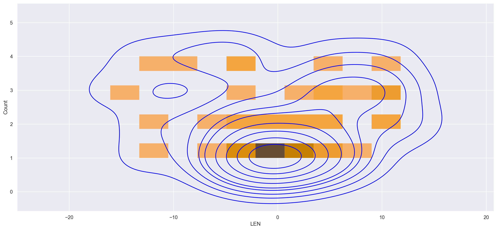
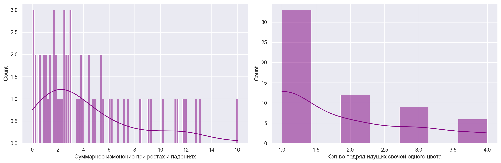

# 🕯️ Анализ японских свечей


Выгружаем данные с Мосбиржи, используя парсер с гитхаба (https://github.com/nerevar/stock_prices).
Имеем таблицы с информацией по акциям, облигациям и курсу валют за указанный период.

```python
# рынок облигаций, Мосбиржа
!python main.py download --engine stock --market bonds --date 2022-06-01 --dateend 2022-11-01

# рынок акций/ETF, Мосбиржа
!python main.py download --engine stock --market shares --date 2022-06-01 --dateend 2022-11-01

# индексы, Мосбиржа
!python main.py download --engine stock --market index ---date 2022-06-01 --dateend 2022-11-01

# валюта, Мосбиржа
!python main.py download --engine currency --market selt --date 2022-06-01 --dateend 2022-11-01
```

```python
# Jupyter notebook setup

import re
import math
import json
import pytz
from datetime import datetime
from pprint import pprint
from collections import OrderedDict

import numpy as np
import pandas as pd
import matplotlib
import matplotlib.pyplot as plt
import seaborn as sns

# === jupyter notebook config === 
# Show all output values in cells
from IPython.core.interactiveshell import InteractiveShell
InteractiveShell.ast_node_interactivity = 'all'

# === numpy & pandas config ===
np.set_printoptions(linewidth=240)
np.set_printoptions(threshold=np.inf)

pd.set_option('max_colwidth', 100)
pd.set_option('display.max_rows', 1000)
pd.set_option('display.max_columns', 500)
pd.set_option('display.float_format', '{: .2f}'.format)

# === graphs config ===
%matplotlib inline
%config InlineBackend.figure_format = 'retina'

plt.rcParams['savefig.dpi'] = 200

plt.rcParams['figure.autolayout'] = False
plt.rcParams['figure.figsize'] = 17, 8
plt.rcParams['axes.labelsize'] = 18
plt.rcParams['axes.titlesize'] = 20

plt.rcParams['font.size'] = 16
plt.rcParams['font.family'] = 'DejaVu Sans'
plt.rcParams['font.weight'] = 'normal'

plt.rcParams['lines.linewidth'] = 2.0
plt.rcParams['lines.markersize'] = 8
plt.rcParams['legend.fontsize'] = 14

plt.style.use('bmh')
plt.style.use('fivethirtyeight')

RANDOM_SEED = 42
np.random.seed(RANDOM_SEED)
```

```python
import pip
pip.main(["install", "mpl_finance"])
from mpl_finance import candlestick_ohlc
import pandas as pd
import matplotlib.dates as mpl_dates

plt.style.use('ggplot')
```

```python
import os

li = []

for root, directories, filenames in os.walk('./quotes'):
    for filename in filenames:
        df = pd.read_csv(os.path.join(root,filename), index_col=None, header=0)
        li.append(df)

df = pd.concat(li, axis=0, ignore_index=True)
```

```python
df.shape
df.head(10)
```

<table border="1" class="dataframe">
  <thead>
    <tr style="text-align: right;">
      <th></th>
      <th>BOARDID</th>
      <th>TRADEDATE</th>
      <th>SHORTNAME</th>
      <th>SECID</th>
      <th>NUMTRADES</th>
      <th>VALUE</th>
      <th>LOW</th>
      <th>HIGH</th>
      <th>CLOSE</th>
      <th>LEGALCLOSEPRICE</th>
      <th>ACCINT</th>
      <th>WAPRICE</th>
      <th>YIELDCLOSE</th>
      <th>OPEN</th>
      <th>VOLUME</th>
      <th>MARKETPRICE2</th>
      <th>MARKETPRICE3</th>
      <th>ADMITTEDQUOTE</th>
      <th>MP2VALTRD</th>
      <th>MARKETPRICE3TRADESVALUE</th>
      <th>ADMITTEDVALUE</th>
      <th>MATDATE</th>
      <th>DURATION</th>
      <th>YIELDATWAP</th>
      <th>IRICPICLOSE</th>
      <th>BEICLOSE</th>
      <th>COUPONPERCENT</th>
      <th>COUPONVALUE</th>
      <th>BUYBACKDATE</th>
      <th>LASTTRADEDATE</th>
      <th>FACEVALUE</th>
      <th>CURRENCYID</th>
      <th>CBRCLOSE</th>
      <th>YIELDTOOFFER</th>
      <th>YIELDLASTCOUPON</th>
      <th>OFFERDATE</th>
      <th>FACEUNIT</th>
      <th>TRADINGSESSION</th>
      <th>WAVAL</th>
      <th>VOLRUR</th>
      <th>timestamp</th>
      <th>open</th>
      <th>high</th>
      <th>low</th>
      <th>close</th>
      <th>adjusted_close</th>
      <th>volume</th>
      <th>dividend_amount</th>
      <th>split_coefficient</th>
      <th>open (RUB)</th>
      <th>high (RUB)</th>
      <th>low (RUB)</th>
      <th>close (RUB)</th>
      <th>open (USD)</th>
      <th>high (USD)</th>
      <th>low (USD)</th>
      <th>close (USD)</th>
      <th>market cap (USD)</th>
    </tr>
  </thead>
  <tbody>
    <tr>
      <th>0</th>
      <td>TQCB</td>
      <td>2022-11-01</td>
      <td>РЖД-19 обл</td>
      <td>RU000A0JQ7Z2</td>
      <td>27.00</td>
      <td>161825.50</td>
      <td>99.12</td>
      <td>99.61</td>
      <td>99.53</td>
      <td>99.53</td>
      <td>24.30</td>
      <td>99.28</td>
      <td>8.31</td>
      <td>99.34</td>
      <td>163.00</td>
      <td>NaN</td>
      <td>99.30</td>
      <td>99.53</td>
      <td>0.00</td>
      <td>5277672.20</td>
      <td>0.00</td>
      <td>2024-07-08</td>
      <td>575.00</td>
      <td>8.48</td>
      <td>NaN</td>
      <td>NaN</td>
      <td>7.85</td>
      <td>39.14</td>
      <td>NaN</td>
      <td>2022-11-01</td>
      <td>1000.00</td>
      <td>SUR</td>
      <td>NaN</td>
      <td>NaN</td>
      <td>NaN</td>
      <td>NaN</td>
      <td>RUB</td>
      <td>3.00</td>
      <td>NaN</td>
      <td>NaN</td>
      <td>NaN</td>
      <td>NaN</td>
      <td>NaN</td>
      <td>NaN</td>
      <td>NaN</td>
      <td>NaN</td>
      <td>NaN</td>
      <td>NaN</td>
      <td>NaN</td>
      <td>NaN</td>
      <td>NaN</td>
      <td>NaN</td>
      <td>NaN</td>
      <td>NaN</td>
      <td>NaN</td>
      <td>NaN</td>
      <td>NaN</td>
      <td>NaN</td>
    </tr>
    <tr>
      <th>1</th>
      <td>TQCB</td>
      <td>2022-11-01</td>
      <td>РЖД-23 обл</td>
      <td>RU000A0JQRD9</td>
      <td>49.00</td>
      <td>320845.00</td>
      <td>97.34</td>
      <td>101.14</td>
      <td>98.70</td>
      <td>98.70</td>
      <td>22.15</td>
      <td>98.72</td>
      <td>8.68</td>
      <td>101.14</td>
      <td>325.00</td>
      <td>NaN</td>
      <td>98.64</td>
      <td>98.70</td>
      <td>0.00</td>
      <td>510967.40</td>
      <td>0.00</td>
      <td>2025-01-16</td>
      <td>740.00</td>
      <td>8.67</td>
      <td>NaN</td>
      <td>NaN</td>
      <td>7.85</td>
      <td>39.14</td>
      <td>NaN</td>
      <td>2022-11-01</td>
      <td>1000.00</td>
      <td>SUR</td>
      <td>NaN</td>
      <td>NaN</td>
      <td>NaN</td>
      <td>NaN</td>
      <td>RUB</td>
      <td>3.00</td>
      <td>NaN</td>
      <td>NaN</td>
      <td>NaN</td>
      <td>NaN</td>
      <td>NaN</td>
      <td>NaN</td>
      <td>NaN</td>
      <td>NaN</td>
      <td>NaN</td>
      <td>NaN</td>
      <td>NaN</td>
      <td>NaN</td>
      <td>NaN</td>
      <td>NaN</td>
      <td>NaN</td>
      <td>NaN</td>
      <td>NaN</td>
      <td>NaN</td>
      <td>NaN</td>
      <td>NaN</td>
    </tr>
    <tr>
      <th>2</th>
      <td>TQCB</td>
      <td>2022-11-01</td>
      <td>СЗКК 03</td>
      <td>RU000A0JRU20</td>
      <td>2.00</td>
      <td>10374.00</td>
      <td>100.00</td>
      <td>100.00</td>
      <td>100.00</td>
      <td>100.00</td>
      <td>9.46</td>
      <td>100.00</td>
      <td>17.93</td>
      <td>100.00</td>
      <td>13.00</td>
      <td>99.67</td>
      <td>99.69</td>
      <td>100.00</td>
      <td>550416.43</td>
      <td>501981.90</td>
      <td>550416.43</td>
      <td>2031-09-26</td>
      <td>157.00</td>
      <td>17.93</td>
      <td>NaN</td>
      <td>NaN</td>
      <td>17.30</td>
      <td>68.84</td>
      <td>2023-04-07</td>
      <td>2022-11-01</td>
      <td>798.00</td>
      <td>SUR</td>
      <td>NaN</td>
      <td>NaN</td>
      <td>NaN</td>
      <td>NaN</td>
      <td>RUB</td>
      <td>3.00</td>
      <td>NaN</td>
      <td>NaN</td>
      <td>NaN</td>
      <td>NaN</td>
      <td>NaN</td>
      <td>NaN</td>
      <td>NaN</td>
      <td>NaN</td>
      <td>NaN</td>
      <td>NaN</td>
      <td>NaN</td>
      <td>NaN</td>
      <td>NaN</td>
      <td>NaN</td>
      <td>NaN</td>
      <td>NaN</td>
      <td>NaN</td>
      <td>NaN</td>
      <td>NaN</td>
      <td>NaN</td>
    </tr>
    <tr>
      <th>3</th>
      <td>TQCB</td>
      <td>2022-11-01</td>
      <td>СЗКК 04</td>
      <td>RU000A0JRU46</td>
      <td>4.00</td>
      <td>41496.00</td>
      <td>100.00</td>
      <td>100.00</td>
      <td>100.00</td>
      <td>100.00</td>
      <td>9.46</td>
      <td>100.00</td>
      <td>17.93</td>
      <td>100.00</td>
      <td>52.00</td>
      <td>100.00</td>
      <td>100.00</td>
      <td>100.00</td>
      <td>899326.05</td>
      <td>895356.00</td>
      <td>899326.05</td>
      <td>2031-09-26</td>
      <td>157.00</td>
      <td>17.93</td>
      <td>NaN</td>
      <td>NaN</td>
      <td>17.30</td>
      <td>68.84</td>
      <td>2023-04-07</td>
      <td>2022-11-01</td>
      <td>798.00</td>
      <td>SUR</td>
      <td>NaN</td>
      <td>NaN</td>
      <td>NaN</td>
      <td>NaN</td>
      <td>RUB</td>
      <td>3.00</td>
      <td>NaN</td>
      <td>NaN</td>
      <td>NaN</td>
      <td>NaN</td>
      <td>NaN</td>
      <td>NaN</td>
      <td>NaN</td>
      <td>NaN</td>
      <td>NaN</td>
      <td>NaN</td>
      <td>NaN</td>
      <td>NaN</td>
      <td>NaN</td>
      <td>NaN</td>
      <td>NaN</td>
      <td>NaN</td>
      <td>NaN</td>
      <td>NaN</td>
      <td>NaN</td>
      <td>NaN</td>
    </tr>
    <tr>
      <th>4</th>
      <td>TQCB</td>
      <td>2022-11-01</td>
      <td>ВЭБ.РФ 21</td>
      <td>RU000A0JS4Z7</td>
      <td>2.00</td>
      <td>21210.00</td>
      <td>101.00</td>
      <td>101.00</td>
      <td>101.00</td>
      <td>101.00</td>
      <td>18.97</td>
      <td>101.00</td>
      <td>7.87</td>
      <td>101.00</td>
      <td>21.00</td>
      <td>NaN</td>
      <td>102.82</td>
      <td>101.00</td>
      <td>0.00</td>
      <td>507941.10</td>
      <td>0.00</td>
      <td>2032-02-17</td>
      <td>119.00</td>
      <td>7.87</td>
      <td>NaN</td>
      <td>NaN</td>
      <td>10.99</td>
      <td>54.80</td>
      <td>2023-02-28</td>
      <td>2022-11-01</td>
      <td>1000.00</td>
      <td>SUR</td>
      <td>NaN</td>
      <td>NaN</td>
      <td>NaN</td>
      <td>NaN</td>
      <td>RUB</td>
      <td>3.00</td>
      <td>NaN</td>
      <td>NaN</td>
      <td>NaN</td>
      <td>NaN</td>
      <td>NaN</td>
      <td>NaN</td>
      <td>NaN</td>
      <td>NaN</td>
      <td>NaN</td>
      <td>NaN</td>
      <td>NaN</td>
      <td>NaN</td>
      <td>NaN</td>
      <td>NaN</td>
      <td>NaN</td>
      <td>NaN</td>
      <td>NaN</td>
      <td>NaN</td>
      <td>NaN</td>
      <td>NaN</td>
    </tr>
    <tr>
      <th>5</th>
      <td>TQCB</td>
      <td>2022-11-01</td>
      <td>РЖД-32 обл</td>
      <td>RU000A0JSGV0</td>
      <td>15.00</td>
      <td>78911.30</td>
      <td>100.16</td>
      <td>101.31</td>
      <td>101.25</td>
      <td>101.28</td>
      <td>31.46</td>
      <td>101.17</td>
      <td>8.09</td>
      <td>100.16</td>
      <td>78.00</td>
      <td>NaN</td>
      <td>101.09</td>
      <td>101.28</td>
      <td>0.00</td>
      <td>545866.70</td>
      <td>0.00</td>
      <td>2032-06-25</td>
      <td>240.00</td>
      <td>8.22</td>
      <td>NaN</td>
      <td>NaN</td>
      <td>9.90</td>
      <td>49.36</td>
      <td>2023-07-07</td>
      <td>2022-11-01</td>
      <td>1000.00</td>
      <td>SUR</td>
      <td>NaN</td>
      <td>NaN</td>
      <td>NaN</td>
      <td>NaN</td>
      <td>RUB</td>
      <td>3.00</td>
      <td>NaN</td>
      <td>NaN</td>
      <td>NaN</td>
      <td>NaN</td>
      <td>NaN</td>
      <td>NaN</td>
      <td>NaN</td>
      <td>NaN</td>
      <td>NaN</td>
      <td>NaN</td>
      <td>NaN</td>
      <td>NaN</td>
      <td>NaN</td>
      <td>NaN</td>
      <td>NaN</td>
      <td>NaN</td>
      <td>NaN</td>
      <td>NaN</td>
      <td>NaN</td>
      <td>NaN</td>
    </tr>
    <tr>
      <th>6</th>
      <td>TQCB</td>
      <td>2022-11-01</td>
      <td>ВЭБ.РФ 18</td>
      <td>RU000A0JT403</td>
      <td>1.00</td>
      <td>960.00</td>
      <td>96.00</td>
      <td>96.00</td>
      <td>96.00</td>
      <td>96.00</td>
      <td>6.72</td>
      <td>96.00</td>
      <td>10.27</td>
      <td>96.00</td>
      <td>1.00</td>
      <td>NaN</td>
      <td>NaN</td>
      <td>96.00</td>
      <td>0.00</td>
      <td>0.00</td>
      <td>0.00</td>
      <td>2032-09-17</td>
      <td>656.00</td>
      <td>10.27</td>
      <td>NaN</td>
      <td>NaN</td>
      <td>7.67</td>
      <td>38.24</td>
      <td>2024-09-27</td>
      <td>2022-11-01</td>
      <td>1000.00</td>
      <td>SUR</td>
      <td>NaN</td>
      <td>10.20</td>
      <td>NaN</td>
      <td>2024-10-01</td>
      <td>RUB</td>
      <td>3.00</td>
      <td>NaN</td>
      <td>NaN</td>
      <td>NaN</td>
      <td>NaN</td>
      <td>NaN</td>
      <td>NaN</td>
      <td>NaN</td>
      <td>NaN</td>
      <td>NaN</td>
      <td>NaN</td>
      <td>NaN</td>
      <td>NaN</td>
      <td>NaN</td>
      <td>NaN</td>
      <td>NaN</td>
      <td>NaN</td>
      <td>NaN</td>
      <td>NaN</td>
      <td>NaN</td>
      <td>NaN</td>
    </tr>
    <tr>
      <th>7</th>
      <td>TQCB</td>
      <td>2022-11-01</td>
      <td>Башнефть06</td>
      <td>RU000A0JTM28</td>
      <td>4.00</td>
      <td>6004.80</td>
      <td>100.08</td>
      <td>100.08</td>
      <td>100.08</td>
      <td>100.08</td>
      <td>19.20</td>
      <td>100.08</td>
      <td>7.43</td>
      <td>100.08</td>
      <td>6.00</td>
      <td>NaN</td>
      <td>99.97</td>
      <td>100.08</td>
      <td>0.00</td>
      <td>565819.90</td>
      <td>0.00</td>
      <td>2023-01-31</td>
      <td>91.00</td>
      <td>7.43</td>
      <td>NaN</td>
      <td>NaN</td>
      <td>7.70</td>
      <td>38.39</td>
      <td>NaN</td>
      <td>2022-11-01</td>
      <td>1000.00</td>
      <td>SUR</td>
      <td>NaN</td>
      <td>NaN</td>
      <td>7.15</td>
      <td>NaN</td>
      <td>RUB</td>
      <td>3.00</td>
      <td>NaN</td>
      <td>NaN</td>
      <td>NaN</td>
      <td>NaN</td>
      <td>NaN</td>
      <td>NaN</td>
      <td>NaN</td>
      <td>NaN</td>
      <td>NaN</td>
      <td>NaN</td>
      <td>NaN</td>
      <td>NaN</td>
      <td>NaN</td>
      <td>NaN</td>
      <td>NaN</td>
      <td>NaN</td>
      <td>NaN</td>
      <td>NaN</td>
      <td>NaN</td>
      <td>NaN</td>
    </tr>
    <tr>
      <th>8</th>
      <td>TQCB</td>
      <td>2022-11-01</td>
      <td>Башнефть07</td>
      <td>RU000A0JTM36</td>
      <td>1.00</td>
      <td>1004.70</td>
      <td>100.47</td>
      <td>100.47</td>
      <td>100.47</td>
      <td>100.47</td>
      <td>20.69</td>
      <td>100.47</td>
      <td>6.38</td>
      <td>100.47</td>
      <td>1.00</td>
      <td>100.05</td>
      <td>100.05</td>
      <td>100.47</td>
      <td>10613238.70</td>
      <td>10260111.70</td>
      <td>10613238.70</td>
      <td>2023-01-31</td>
      <td>91.00</td>
      <td>6.38</td>
      <td>NaN</td>
      <td>NaN</td>
      <td>8.30</td>
      <td>41.39</td>
      <td>NaN</td>
      <td>2022-11-01</td>
      <td>1000.00</td>
      <td>SUR</td>
      <td>NaN</td>
      <td>NaN</td>
      <td>6.17</td>
      <td>NaN</td>
      <td>RUB</td>
      <td>3.00</td>
      <td>NaN</td>
      <td>NaN</td>
      <td>NaN</td>
      <td>NaN</td>
      <td>NaN</td>
      <td>NaN</td>
      <td>NaN</td>
      <td>NaN</td>
      <td>NaN</td>
      <td>NaN</td>
      <td>NaN</td>
      <td>NaN</td>
      <td>NaN</td>
      <td>NaN</td>
      <td>NaN</td>
      <td>NaN</td>
      <td>NaN</td>
      <td>NaN</td>
      <td>NaN</td>
      <td>NaN</td>
    </tr>
    <tr>
      <th>9</th>
      <td>TQCB</td>
      <td>2022-11-01</td>
      <td>Башнефть08</td>
      <td>RU000A0JTM44</td>
      <td>20.00</td>
      <td>224906.00</td>
      <td>99.60</td>
      <td>100.01</td>
      <td>99.90</td>
      <td>99.90</td>
      <td>19.20</td>
      <td>99.96</td>
      <td>8.20</td>
      <td>100.01</td>
      <td>225.00</td>
      <td>NaN</td>
      <td>99.99</td>
      <td>99.90</td>
      <td>0.00</td>
      <td>792906.00</td>
      <td>0.00</td>
      <td>2023-01-31</td>
      <td>91.00</td>
      <td>7.94</td>
      <td>NaN</td>
      <td>NaN</td>
      <td>7.70</td>
      <td>38.39</td>
      <td>NaN</td>
      <td>2022-11-01</td>
      <td>1000.00</td>
      <td>SUR</td>
      <td>NaN</td>
      <td>NaN</td>
      <td>7.87</td>
      <td>NaN</td>
      <td>RUB</td>
      <td>3.00</td>
      <td>NaN</td>
      <td>NaN</td>
      <td>NaN</td>
      <td>NaN</td>
      <td>NaN</td>
      <td>NaN</td>
      <td>NaN</td>
      <td>NaN</td>
      <td>NaN</td>
      <td>NaN</td>
      <td>NaN</td>
      <td>NaN</td>
      <td>NaN</td>
      <td>NaN</td>
      <td>NaN</td>
      <td>NaN</td>
      <td>NaN</td>
      <td>NaN</td>
      <td>NaN</td>
      <td>NaN</td>
    </tr>
  </tbody>
</table>
</div>

```python
sber = df[(df.BOARDID == 'TQBR') & (df.SECID == 'SBER')].sort_values(by='TRADEDATE')
# sber.dropna(axis=1, how='all')[['OPEN', 'CLOSE', 'VOLUME', 'TRADEDATE']]
sber.head(10)
```

<div>
<style scoped>
    .dataframe tbody tr th:only-of-type {
        vertical-align: middle;
    }

<table border="1" class="dataframe">
  <thead>
    <tr style="text-align: right;">
      <th></th>
      <th>BOARDID</th>
      <th>TRADEDATE</th>
      <th>SHORTNAME</th>
      <th>SECID</th>
      <th>NUMTRADES</th>
      <th>VALUE</th>
      <th>LOW</th>
      <th>HIGH</th>
      <th>CLOSE</th>
      <th>LEGALCLOSEPRICE</th>
      <th>ACCINT</th>
      <th>WAPRICE</th>
      <th>YIELDCLOSE</th>
      <th>OPEN</th>
      <th>VOLUME</th>
      <th>MARKETPRICE2</th>
      <th>MARKETPRICE3</th>
      <th>ADMITTEDQUOTE</th>
      <th>MP2VALTRD</th>
      <th>MARKETPRICE3TRADESVALUE</th>
      <th>ADMITTEDVALUE</th>
      <th>MATDATE</th>
      <th>DURATION</th>
      <th>YIELDATWAP</th>
      <th>IRICPICLOSE</th>
      <th>BEICLOSE</th>
      <th>COUPONPERCENT</th>
      <th>COUPONVALUE</th>
      <th>BUYBACKDATE</th>
      <th>LASTTRADEDATE</th>
      <th>FACEVALUE</th>
      <th>CURRENCYID</th>
      <th>CBRCLOSE</th>
      <th>YIELDTOOFFER</th>
      <th>YIELDLASTCOUPON</th>
      <th>OFFERDATE</th>
      <th>FACEUNIT</th>
      <th>TRADINGSESSION</th>
      <th>WAVAL</th>
      <th>VOLRUR</th>
      <th>timestamp</th>
      <th>open</th>
      <th>high</th>
      <th>low</th>
      <th>close</th>
      <th>adjusted_close</th>
      <th>volume</th>
      <th>dividend_amount</th>
      <th>split_coefficient</th>
      <th>open (RUB)</th>
      <th>high (RUB)</th>
      <th>low (RUB)</th>
      <th>close (RUB)</th>
      <th>open (USD)</th>
      <th>high (USD)</th>
      <th>low (USD)</th>
      <th>close (USD)</th>
      <th>market cap (USD)</th>
    </tr>
  </thead>
  <tbody>
    <tr>
      <th>161527</th>
      <td>TQBR</td>
      <td>2022-06-01</td>
      <td>Сбербанк</td>
      <td>SBER</td>
      <td>104059.00</td>
      <td>5296798375.30</td>
      <td>117.00</td>
      <td>122.69</td>
      <td>121.97</td>
      <td>121.97</td>
      <td>NaN</td>
      <td>120.97</td>
      <td>NaN</td>
      <td>117.50</td>
      <td>43785040.00</td>
      <td>120.97</td>
      <td>120.97</td>
      <td>121.97</td>
      <td>5296798375.30</td>
      <td>5296798375.30</td>
      <td>5296798375.30</td>
      <td>NaN</td>
      <td>NaN</td>
      <td>NaN</td>
      <td>NaN</td>
      <td>NaN</td>
      <td>NaN</td>
      <td>NaN</td>
      <td>NaN</td>
      <td>NaN</td>
      <td>NaN</td>
      <td>NaN</td>
      <td>NaN</td>
      <td>NaN</td>
      <td>NaN</td>
      <td>NaN</td>
      <td>NaN</td>
      <td>3.00</td>
      <td>0.00</td>
      <td>NaN</td>
      <td>NaN</td>
      <td>NaN</td>
      <td>NaN</td>
      <td>NaN</td>
      <td>NaN</td>
      <td>NaN</td>
      <td>NaN</td>
      <td>NaN</td>
      <td>NaN</td>
      <td>NaN</td>
      <td>NaN</td>
      <td>NaN</td>
      <td>NaN</td>
      <td>NaN</td>
      <td>NaN</td>
      <td>NaN</td>
      <td>NaN</td>
      <td>NaN</td>
    </tr>
    <tr>
      <th>142394</th>
      <td>TQBR</td>
      <td>2022-06-02</td>
      <td>Сбербанк</td>
      <td>SBER</td>
      <td>101114.00</td>
      <td>5125256938.40</td>
      <td>118.50</td>
      <td>122.39</td>
      <td>119.00</td>
      <td>119.00</td>
      <td>NaN</td>
      <td>119.87</td>
      <td>NaN</td>
      <td>121.90</td>
      <td>42769900.00</td>
      <td>119.83</td>
      <td>119.83</td>
      <td>119.00</td>
      <td>5125256938.40</td>
      <td>5125256938.40</td>
      <td>5125256938.40</td>
      <td>NaN</td>
      <td>NaN</td>
      <td>NaN</td>
      <td>NaN</td>
      <td>NaN</td>
      <td>NaN</td>
      <td>NaN</td>
      <td>NaN</td>
      <td>NaN</td>
      <td>NaN</td>
      <td>NaN</td>
      <td>NaN</td>
      <td>NaN</td>
      <td>NaN</td>
      <td>NaN</td>
      <td>NaN</td>
      <td>3.00</td>
      <td>0.00</td>
      <td>NaN</td>
      <td>NaN</td>
      <td>NaN</td>
      <td>NaN</td>
      <td>NaN</td>
      <td>NaN</td>
      <td>NaN</td>
      <td>NaN</td>
      <td>NaN</td>
      <td>NaN</td>
      <td>NaN</td>
      <td>NaN</td>
      <td>NaN</td>
      <td>NaN</td>
      <td>NaN</td>
      <td>NaN</td>
      <td>NaN</td>
      <td>NaN</td>
      <td>NaN</td>
    </tr>
    <tr>
      <th>140874</th>
      <td>TQBR</td>
      <td>2022-06-03</td>
      <td>Сбербанк</td>
      <td>SBER</td>
      <td>80343.00</td>
      <td>4067212982.50</td>
      <td>117.18</td>
      <td>120.16</td>
      <td>119.21</td>
      <td>119.21</td>
      <td>NaN</td>
      <td>118.43</td>
      <td>NaN</td>
      <td>119.29</td>
      <td>34341530.00</td>
      <td>118.43</td>
      <td>118.43</td>
      <td>119.21</td>
      <td>4067212982.50</td>
      <td>4067212982.50</td>
      <td>4067212982.50</td>
      <td>NaN</td>
      <td>NaN</td>
      <td>NaN</td>
      <td>NaN</td>
      <td>NaN</td>
      <td>NaN</td>
      <td>NaN</td>
      <td>NaN</td>
      <td>NaN</td>
      <td>NaN</td>
      <td>NaN</td>
      <td>NaN</td>
      <td>NaN</td>
      <td>NaN</td>
      <td>NaN</td>
      <td>NaN</td>
      <td>3.00</td>
      <td>0.00</td>
      <td>NaN</td>
      <td>NaN</td>
      <td>NaN</td>
      <td>NaN</td>
      <td>NaN</td>
      <td>NaN</td>
      <td>NaN</td>
      <td>NaN</td>
      <td>NaN</td>
      <td>NaN</td>
      <td>NaN</td>
      <td>NaN</td>
      <td>NaN</td>
      <td>NaN</td>
      <td>NaN</td>
      <td>NaN</td>
      <td>NaN</td>
      <td>NaN</td>
      <td>NaN</td>
    </tr>
    <tr>
      <th>163334</th>
      <td>TQBR</td>
      <td>2022-06-06</td>
      <td>Сбербанк</td>
      <td>SBER</td>
      <td>61834.00</td>
      <td>2652231034.20</td>
      <td>118.29</td>
      <td>120.35</td>
      <td>118.78</td>
      <td>118.78</td>
      <td>NaN</td>
      <td>119.03</td>
      <td>NaN</td>
      <td>119.26</td>
      <td>22281970.00</td>
      <td>119.03</td>
      <td>119.03</td>
      <td>118.78</td>
      <td>2652231034.20</td>
      <td>2652231034.20</td>
      <td>2652231034.20</td>
      <td>NaN</td>
      <td>NaN</td>
      <td>NaN</td>
      <td>NaN</td>
      <td>NaN</td>
      <td>NaN</td>
      <td>NaN</td>
      <td>NaN</td>
      <td>NaN</td>
      <td>NaN</td>
      <td>NaN</td>
      <td>NaN</td>
      <td>NaN</td>
      <td>NaN</td>
      <td>NaN</td>
      <td>NaN</td>
      <td>3.00</td>
      <td>0.00</td>
      <td>NaN</td>
      <td>NaN</td>
      <td>NaN</td>
      <td>NaN</td>
      <td>NaN</td>
      <td>NaN</td>
      <td>NaN</td>
      <td>NaN</td>
      <td>NaN</td>
      <td>NaN</td>
      <td>NaN</td>
      <td>NaN</td>
      <td>NaN</td>
      <td>NaN</td>
      <td>NaN</td>
      <td>NaN</td>
      <td>NaN</td>
      <td>NaN</td>
      <td>NaN</td>
    </tr>
    <tr>
      <th>156434</th>
      <td>TQBR</td>
      <td>2022-06-07</td>
      <td>Сбербанк</td>
      <td>SBER</td>
      <td>59242.00</td>
      <td>2629117760.20</td>
      <td>117.32</td>
      <td>118.90</td>
      <td>118.32</td>
      <td>118.32</td>
      <td>NaN</td>
      <td>118.04</td>
      <td>NaN</td>
      <td>118.68</td>
      <td>22274020.00</td>
      <td>118.04</td>
      <td>118.04</td>
      <td>118.32</td>
      <td>2629117760.20</td>
      <td>2629117760.20</td>
      <td>2629117760.20</td>
      <td>NaN</td>
      <td>NaN</td>
      <td>NaN</td>
      <td>NaN</td>
      <td>NaN</td>
      <td>NaN</td>
      <td>NaN</td>
      <td>NaN</td>
      <td>NaN</td>
      <td>NaN</td>
      <td>NaN</td>
      <td>NaN</td>
      <td>NaN</td>
      <td>NaN</td>
      <td>NaN</td>
      <td>NaN</td>
      <td>3.00</td>
      <td>0.00</td>
      <td>NaN</td>
      <td>NaN</td>
      <td>NaN</td>
      <td>NaN</td>
      <td>NaN</td>
      <td>NaN</td>
      <td>NaN</td>
      <td>NaN</td>
      <td>NaN</td>
      <td>NaN</td>
      <td>NaN</td>
      <td>NaN</td>
      <td>NaN</td>
      <td>NaN</td>
      <td>NaN</td>
      <td>NaN</td>
      <td>NaN</td>
      <td>NaN</td>
      <td>NaN</td>
    </tr>
    <tr>
      <th>159960</th>
      <td>TQBR</td>
      <td>2022-06-08</td>
      <td>Сбербанк</td>
      <td>SBER</td>
      <td>91893.00</td>
      <td>5003858591.90</td>
      <td>118.40</td>
      <td>122.19</td>
      <td>119.90</td>
      <td>119.90</td>
      <td>NaN</td>
      <td>120.53</td>
      <td>NaN</td>
      <td>118.51</td>
      <td>41514970.00</td>
      <td>120.53</td>
      <td>120.53</td>
      <td>119.90</td>
      <td>5003858591.90</td>
      <td>5003858591.90</td>
      <td>5003858591.90</td>
      <td>NaN</td>
      <td>NaN</td>
      <td>NaN</td>
      <td>NaN</td>
      <td>NaN</td>
      <td>NaN</td>
      <td>NaN</td>
      <td>NaN</td>
      <td>NaN</td>
      <td>NaN</td>
      <td>NaN</td>
      <td>NaN</td>
      <td>NaN</td>
      <td>NaN</td>
      <td>NaN</td>
      <td>NaN</td>
      <td>3.00</td>
      <td>0.00</td>
      <td>NaN</td>
      <td>NaN</td>
      <td>NaN</td>
      <td>NaN</td>
      <td>NaN</td>
      <td>NaN</td>
      <td>NaN</td>
      <td>NaN</td>
      <td>NaN</td>
      <td>NaN</td>
      <td>NaN</td>
      <td>NaN</td>
      <td>NaN</td>
      <td>NaN</td>
      <td>NaN</td>
      <td>NaN</td>
      <td>NaN</td>
      <td>NaN</td>
      <td>NaN</td>
    </tr>
    <tr>
      <th>156837</th>
      <td>TQBR</td>
      <td>2022-06-09</td>
      <td>Сбербанк</td>
      <td>SBER</td>
      <td>80871.00</td>
      <td>3477327986.10</td>
      <td>117.70</td>
      <td>120.20</td>
      <td>118.20</td>
      <td>118.20</td>
      <td>NaN</td>
      <td>118.39</td>
      <td>NaN</td>
      <td>120.00</td>
      <td>29371970.00</td>
      <td>118.39</td>
      <td>118.39</td>
      <td>118.20</td>
      <td>3477327986.10</td>
      <td>3477327986.10</td>
      <td>3477327986.10</td>
      <td>NaN</td>
      <td>NaN</td>
      <td>NaN</td>
      <td>NaN</td>
      <td>NaN</td>
      <td>NaN</td>
      <td>NaN</td>
      <td>NaN</td>
      <td>NaN</td>
      <td>NaN</td>
      <td>NaN</td>
      <td>NaN</td>
      <td>NaN</td>
      <td>NaN</td>
      <td>NaN</td>
      <td>NaN</td>
      <td>3.00</td>
      <td>0.00</td>
      <td>NaN</td>
      <td>NaN</td>
      <td>NaN</td>
      <td>NaN</td>
      <td>NaN</td>
      <td>NaN</td>
      <td>NaN</td>
      <td>NaN</td>
      <td>NaN</td>
      <td>NaN</td>
      <td>NaN</td>
      <td>NaN</td>
      <td>NaN</td>
      <td>NaN</td>
      <td>NaN</td>
      <td>NaN</td>
      <td>NaN</td>
      <td>NaN</td>
      <td>NaN</td>
    </tr>
    <tr>
      <th>152211</th>
      <td>TQBR</td>
      <td>2022-06-10</td>
      <td>Сбербанк</td>
      <td>SBER</td>
      <td>66107.00</td>
      <td>3006397517.20</td>
      <td>117.73</td>
      <td>119.55</td>
      <td>118.07</td>
      <td>118.07</td>
      <td>NaN</td>
      <td>118.49</td>
      <td>NaN</td>
      <td>118.03</td>
      <td>25373000.00</td>
      <td>118.49</td>
      <td>118.49</td>
      <td>118.07</td>
      <td>3006397517.20</td>
      <td>3006397517.20</td>
      <td>3006397517.20</td>
      <td>NaN</td>
      <td>NaN</td>
      <td>NaN</td>
      <td>NaN</td>
      <td>NaN</td>
      <td>NaN</td>
      <td>NaN</td>
      <td>NaN</td>
      <td>NaN</td>
      <td>NaN</td>
      <td>NaN</td>
      <td>NaN</td>
      <td>NaN</td>
      <td>NaN</td>
      <td>NaN</td>
      <td>NaN</td>
      <td>3.00</td>
      <td>0.00</td>
      <td>NaN</td>
      <td>NaN</td>
      <td>NaN</td>
      <td>NaN</td>
      <td>NaN</td>
      <td>NaN</td>
      <td>NaN</td>
      <td>NaN</td>
      <td>NaN</td>
      <td>NaN</td>
      <td>NaN</td>
      <td>NaN</td>
      <td>NaN</td>
      <td>NaN</td>
      <td>NaN</td>
      <td>NaN</td>
      <td>NaN</td>
      <td>NaN</td>
      <td>NaN</td>
    </tr>
    <tr>
      <th>168091</th>
      <td>TQBR</td>
      <td>2022-06-14</td>
      <td>Сбербанк</td>
      <td>SBER</td>
      <td>92504.00</td>
      <td>4454820677.70</td>
      <td>115.80</td>
      <td>119.88</td>
      <td>118.98</td>
      <td>118.98</td>
      <td>NaN</td>
      <td>118.19</td>
      <td>NaN</td>
      <td>118.03</td>
      <td>37690460.00</td>
      <td>118.19</td>
      <td>118.19</td>
      <td>118.98</td>
      <td>4454820677.70</td>
      <td>4454820677.70</td>
      <td>4454820677.70</td>
      <td>NaN</td>
      <td>NaN</td>
      <td>NaN</td>
      <td>NaN</td>
      <td>NaN</td>
      <td>NaN</td>
      <td>NaN</td>
      <td>NaN</td>
      <td>NaN</td>
      <td>NaN</td>
      <td>NaN</td>
      <td>NaN</td>
      <td>NaN</td>
      <td>NaN</td>
      <td>NaN</td>
      <td>NaN</td>
      <td>3.00</td>
      <td>0.00</td>
      <td>NaN</td>
      <td>NaN</td>
      <td>NaN</td>
      <td>NaN</td>
      <td>NaN</td>
      <td>NaN</td>
      <td>NaN</td>
      <td>NaN</td>
      <td>NaN</td>
      <td>NaN</td>
      <td>NaN</td>
      <td>NaN</td>
      <td>NaN</td>
      <td>NaN</td>
      <td>NaN</td>
      <td>NaN</td>
      <td>NaN</td>
      <td>NaN</td>
      <td>NaN</td>
    </tr>
    <tr>
      <th>167613</th>
      <td>TQBR</td>
      <td>2022-06-15</td>
      <td>Сбербанк</td>
      <td>SBER</td>
      <td>109377.00</td>
      <td>6293254524.80</td>
      <td>118.71</td>
      <td>121.71</td>
      <td>121.14</td>
      <td>121.14</td>
      <td>NaN</td>
      <td>120.46</td>
      <td>NaN</td>
      <td>119.40</td>
      <td>52262500.00</td>
      <td>120.42</td>
      <td>120.42</td>
      <td>121.14</td>
      <td>6293254524.80</td>
      <td>6293254524.80</td>
      <td>6293254524.80</td>
      <td>NaN</td>
      <td>NaN</td>
      <td>NaN</td>
      <td>NaN</td>
      <td>NaN</td>
      <td>NaN</td>
      <td>NaN</td>
      <td>NaN</td>
      <td>NaN</td>
      <td>NaN</td>
      <td>NaN</td>
      <td>NaN</td>
      <td>NaN</td>
      <td>NaN</td>
      <td>NaN</td>
      <td>NaN</td>
      <td>3.00</td>
      <td>0.00</td>
      <td>NaN</td>
      <td>NaN</td>
      <td>NaN</td>
      <td>NaN</td>
      <td>NaN</td>
      <td>NaN</td>
      <td>NaN</td>
      <td>NaN</td>
      <td>NaN</td>
      <td>NaN</td>
      <td>NaN</td>
      <td>NaN</td>
      <td>NaN</td>
      <td>NaN</td>
      <td>NaN</td>
      <td>NaN</td>
      <td>NaN</td>
      <td>NaN</td>
      <td>NaN</td>
    </tr>
  </tbody>
</table>
</div>

```python
red = "#FF4500"
green = "#00B060"
```

```python
import datetime
  
# Extracting Data for plotting
ohlc = sber.loc[:, ['TRADEDATE', 'OPEN', 'HIGH', 'LOW', 'CLOSE']]
  
# Converting date into datetime format
ohlc['TRADEDATE'] = pd.to_datetime(ohlc['TRADEDATE'])
ohlc['TRADEDATE'] = ohlc['TRADEDATE'].apply(mpl_dates.date2num)
ohlc = ohlc.astype(float)
  
# Creating Subplots
fig, ax = plt.subplots()
  
candlestick_ohlc(ax, ohlc.values, width=0.6,
                 colorup= green, colordown= red, alpha=0.9)
  
# Setting labels & titles
ax.set_xlabel('TRADEDATE')
ax.set_ylabel('Price')
fig.suptitle('Daily Candlestick Chart of NIFTY50')
  
# Formatting Date
date_format = mpl_dates.DateFormatter('%Y-%m-%d')
ax.xaxis.set_major_formatter(date_format)
fig.autofmt_xdate()
  
fig.tight_layout()
plt.show();
  

```



```python
ohlc['TRADEDATE'] = pd.to_datetime(sber['TRADEDATE'])
ohlc["LEN"] = ohlc["CLOSE"] - ohlc["OPEN"]
ohlc.head(10)
```

<div>
<style scoped>
    .dataframe tbody tr th:only-of-type {
        vertical-align: middle;
    }

<table border="1" class="dataframe">
  <thead>
    <tr style="text-align: right;">
      <th></th>
      <th>TRADEDATE</th>
      <th>OPEN</th>
      <th>HIGH</th>
      <th>LOW</th>
      <th>CLOSE</th>
      <th>LEN</th>
    </tr>
  </thead>
  <tbody>
    <tr>
      <th>161527</th>
      <td>2022-06-01</td>
      <td>117.50</td>
      <td>122.69</td>
      <td>117.00</td>
      <td>121.97</td>
      <td>4.47</td>
    </tr>
    <tr>
      <th>142394</th>
      <td>2022-06-02</td>
      <td>121.90</td>
      <td>122.39</td>
      <td>118.50</td>
      <td>119.00</td>
      <td>-2.90</td>
    </tr>
    <tr>
      <th>140874</th>
      <td>2022-06-03</td>
      <td>119.29</td>
      <td>120.16</td>
      <td>117.18</td>
      <td>119.21</td>
      <td>-0.08</td>
    </tr>
    <tr>
      <th>163334</th>
      <td>2022-06-06</td>
      <td>119.26</td>
      <td>120.35</td>
      <td>118.29</td>
      <td>118.78</td>
      <td>-0.48</td>
    </tr>
    <tr>
      <th>156434</th>
      <td>2022-06-07</td>
      <td>118.68</td>
      <td>118.90</td>
      <td>117.32</td>
      <td>118.32</td>
      <td>-0.36</td>
    </tr>
    <tr>
      <th>159960</th>
      <td>2022-06-08</td>
      <td>118.51</td>
      <td>122.19</td>
      <td>118.40</td>
      <td>119.90</td>
      <td>1.39</td>
    </tr>
    <tr>
      <th>156837</th>
      <td>2022-06-09</td>
      <td>120.00</td>
      <td>120.20</td>
      <td>117.70</td>
      <td>118.20</td>
      <td>-1.80</td>
    </tr>
    <tr>
      <th>152211</th>
      <td>2022-06-10</td>
      <td>118.03</td>
      <td>119.55</td>
      <td>117.73</td>
      <td>118.07</td>
      <td>0.04</td>
    </tr>
    <tr>
      <th>168091</th>
      <td>2022-06-14</td>
      <td>118.03</td>
      <td>119.88</td>
      <td>115.80</td>
      <td>118.98</td>
      <td>0.95</td>
    </tr>
    <tr>
      <th>167613</th>
      <td>2022-06-15</td>
      <td>119.40</td>
      <td>121.71</td>
      <td>118.71</td>
      <td>121.14</td>
      <td>1.74</td>
    </tr>
  </tbody>
</table>
</div>

```python
import pandas as pd
import numpy as np 
import seaborn as sns
import matplotlib.pyplot as plt
sns.set()
```

```python
my_palette = [red if (i < 0) else green for i in ohlc["SIGN"] ]
```

```python
ohlc["SIGN"] = ohlc["LEN"] / abs(ohlc["LEN"])
```

```python
%time

df2 = pd.DataFrame(columns=["LEN", "Count"])
i = 0
while i < len(ohlc):
    cur_sum = ohlc["LEN"].iloc[i]
    date = ohlc.index[i]
    cur_num = 1
    while (i + 1 < len(ohlc) ) and (ohlc["SIGN"].iloc[i] == ohlc["SIGN"].iloc[i + 1]):
        cur_num += 1
        cur_sum += ohlc["LEN"].iloc[i + 1]
        i += 1
    else:
        df2 = pd.concat([df2, pd.DataFrame({"LEN" : [cur_sum], "Count" : [cur_num]}, index=[date])])
    i += 1
```


```python
fig = sns.barplot(data = ohlc, x = "TRADEDATE", y = "LEN", palette = my_palette, alpha = 0.6);
fig.axes.get_xaxis().set_visible(False)
```



```python
count = 0
for i in (ohlc["LEN"]):
    if i < 0:
        count += 1
print(count)
```

    52

```python

plt.xticks(np.arange(-10, 10, step = 2));
my_palette1 = [red if (i > 0) else green for i in ohlc["SIGN"] ]
sns.histplot(data = ohlc, x = "LEN", kde = True, bins = 80, hue='SIGN', palette = my_palette1);
sns.histplot(data = ohlc, x = "LEN", kde = True, bins = 80, fill = 0);
```




```python
rise = ohlc[ohlc["LEN"] > 0][["LEN"]]
fall = abs(ohlc[ohlc["LEN"] < 0][["LEN"]])
```

```python
green_palette = [green for i in rise ]
red_palette = [red for i in fall ]

fig, (ax1, ax2) = plt.subplots(1, 2, figsize=(15, 5))

sns.histplot(data=rise, kde=True, bins = 30,  ax=ax1, palette = green_palette);
ax1.set(xlabel="Гистограмма ростов")

sns.histplot(data=fall, kde=True, bins = 30, ax=ax2, palette = red_palette);
ax2.set(xlabel="Гистограмма падений")


fig.tight_layout();
plt.show();
```



## 3. Аппроксимация отрицательным биномиальным распределением

```python
from scipy.stats import nbinom
from scipy.stats import chisquare
def sample_nbinom_moments(observed):

    mean = observed.mean()
    var = observed.var()

    # param:
    p = mean / var  
    r = p * mean / (1 - p)
    expected = nbinom.rvs(r, p, size = len(observed))   

    fig, axes = plt.subplots(1, 1, figsize=(15, 10))
    axes.set(xlabel="Носитель")
  
    sns.histplot(data=observed, bins=30, ax=axes)
    sns.histplot(data=expected, ax=axes)
  
    fig.tight_layout()
    plt.show()
      
    return (r, p)

def chisquare_nbinom(observed, _r, _p):
    n = max(observed)
    f_obs = np.zeros(n)
    for i in range(n):
        f_obs[i] =  np.sum(observed == i)

    f_exp = np.zeros(n)
    for i in range(n):
        f_exp[i] = nbinom.pmf(i, _r, _p) * len(observed)

    f_exp[0] += sum(f_obs) - sum(f_exp)
  
    return chisquare(f_obs, f_exp)
```

## 4. Аппоксимация обобщенным $\gamma$-распределением

```python
from scipy.stats import gengamma
from scipy.stats import ks_2samp
def sample_gengamma(X):
    params = gengamma.fit(X)
    X_gengamma = gengamma.rvs(*params, size = len(X))
  
    fig, axes = plt.subplots(1, 1, figsize=(15, 10))
  
    sns.histplot(data=X, ax=axes)
    sns.histplot(data=X_gengamma, ax=axes)
  
    return params
def ks_2samp_gengamma(X, _params):
    X_gengamma = gengamma.rvs(*params, size = len(X))
    return ks_2samp(X, X_gengamma)
```

## 5. $\sum$ подряд идущих ростов и падений

```python
cols = ["LEN", "Count"]
xlab = ["Суммарное изменение при ростах и падениях", 
        "Кол-во подряд идущих свечей одного цвета"]
fig, axes = plt.subplots()

sns.kdeplot(df2, x=cols[0], y=cols[1], ax=axes, color = 'blue');
sns.histplot(df2, x=cols[0], y=cols[1], ax=axes, color = 'orange');
```



```python
fig, (ax1, ax2) = plt.subplots(1, 2, figsize=(15, 5))

sns.histplot(data=df2[cols[0]].apply(abs), kde=True, bins=100, ax=ax1, color = 'purple');
ax1.set(xlabel=xlab[0])
sns.histplot(data=df2[cols[1]], kde=True, ax=ax2, color = 'purple');
ax2.set(xlabel=xlab[1])
fig.tight_layout()
plt.show();
```


